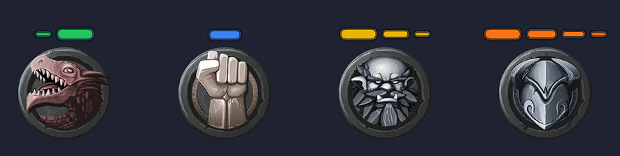
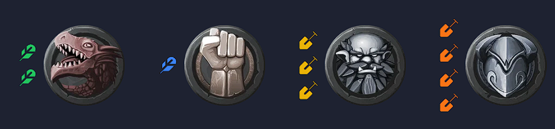

# Daggerheight

An [Owlbear Rodeo](https://www.owlbear.rodeo/) extension that marks **Daggerheart**
range bands directly on a token: Very Close, Close, Far, Very Far — each Up or
Down — shown as colored icons next to the token.


## Install

Add this extension to your room using its manifest URL:

```
https://daggerheight.ijpedraza.com/manifest.json
```

## How to use

1. Select a token on the Character, Mount, or Prop layer and open its context menu.
2. Click **Altitude**.
3. Pick a range and a direction. Clicking the same marker again removes it.


Each token keeps its own marker, and markers move and scale together with their
token. Selecting multiple tokens (even across different layers) applies the
change to all of them at once.

## Icon shapes

Pick from several icon styles in Settings — plain triangles that point up or
down, or shapes that instead grow or shrink in size to show direction: bars,
circles, diamonds, squares, stars, a stepped triangle, or a themed
feather/shovel pair.




## Settings

The gear icon opens a settings panel — shared by the whole room and set by the
GM — to customize:

- **Icon shape**, size, and how far icons sit from the token.
- **Colors per range**, or a one-click theme matching the colorblind-friendly
  palettes from the [Ranges](https://extensions.owlbear.rodeo/ranges) extension.
- **Position** relative to the token (left, right, top, or bottom).
- Whether markers **scale with the token** or stay a fixed size when you resize it.
- Whether the **"Down" direction** and the **range labels** are shown at all,
  for a more compact panel when you don't need them.

Every change previews live on the board and in the picker as you make it —
nothing is applied for real until you hit Save, and Cancel reverts everything.


The interface itself is available in English and Spanish, as a per-player
preference.

## Development

```
npm install
npm run dev
```

This starts a local dev server (`http://localhost:5173` by default). Owlbear
Rodeo allows loading development extensions from `localhost` without HTTPS.

To install the dev build in a room:

1. Open a room in Owlbear Rodeo.
2. Go to the extensions tab (plug icon) → **Add Custom Extension**.
3. Paste the manifest URL: `http://localhost:5173/manifest.json`.

With the dev server running, code changes hot-reload automatically.

## Production build

```
npm run build
```

Generates the `dist/` folder, ready to deploy to any static host. Point
Owlbear Rodeo at `https://<your-domain>/manifest.json` once deployed.

## Project structure

- `public/manifest.json` — extension metadata.
- `background.html` / `src/background.ts` — runs once when the extension loads;
  registers the context menu item, sized to fit whichever rows are visible.
- `index.html` / `src/main.ts` — the range picker UI shown when the context
  menu item is clicked.
- `settings.html` / `src/settings-main.ts` — the settings modal (shape, size,
  colors, position, language, and the live-preview logic).
- `src/altitude.ts` — the 4 range bands, the 2 directions, and the icon-shape
  geometry (shared between the on-map markers and the picker's preview icons).
- `src/markers.ts` — creates/reads/deletes the marker (a `PATH` item attached
  to the token) in the scene, and rebuilds every marker when settings change.
- `src/settings.ts` — reads/writes settings (room metadata) and language
  (player metadata).
- `src/theme.ts` — syncs Owlbear Rodeo's light/dark theme into CSS variables.
- `src/i18n.ts` — UI strings (English/Spanish).

## Support

Found a bug or have a feature request? Open an issue at
<https://github.com/nachoijp/daggerheight/issues>.
