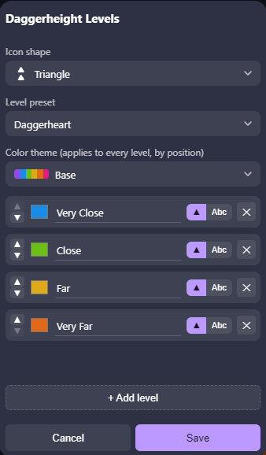
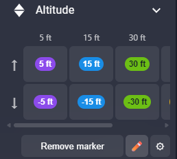
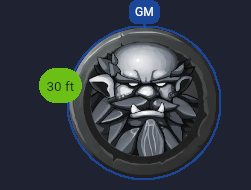

# Daggerheight

An [Owlbear Rodeo](https://www.owlbear.rodeo/) extension that marks distance or
range bands directly on a token — Daggerheart's Very Close/Close/Far/Very Far
by default, but fully customizable: define your own set of distances (in feet,
meters, or anything else) for any game system, shown as colored icons or
numeric labels next to the token.


## Install

Add this extension to your room using its manifest URL:

```
https://daggerheight.ijpedraza.com/manifest.json
```

## How to use

1. Select a token on the Character, Mount, or Prop layer and open its context menu.
2. Click **Altitude**.
3. Pick a distance and a direction. Clicking the same marker again removes it.


Each token keeps its own marker, and markers move and scale together with their
token. Selecting multiple tokens (even across different layers) applies the
change to all of them at once. When there are more distances than fit the
panel's width, it scrolls horizontally instead of squeezing the columns.

## Distance levels

The **✏️** button opens the level editor, shared by the whole room and set by
the GM:

- Start from the **Daggerheart** preset (Very Close/Close/Far/Very Far) or the
  **Dragons** preset (5/15/30/60/120 ft), or build your own from scratch —
  add, remove, reorder, and rename as many levels as your game needs.
- Each level renders either as **stacked icons** (like Daggerheart's bands) or
  as a **numeric text label** (like a feet/meters distance) — pick per level.
  A text label placed looking Down gets a "-" prefix so it reads differently
  from the same distance Up.
- **Color themes** — Base, and three colorblind-friendly variants
  (Deuteranopia, Tritanopia, Protanopia) matching the
  [Ranges](https://extensions.owlbear.rodeo/ranges) extension's palettes,
  plus a grayscale option — recolor every level at once, by position. Colors
  can still be fine-tuned per level afterward.
- Save several custom presets and switch between them at any time; nothing
  is lost when you switch away from one.






## Icon shapes

For icon-mode levels, pick from several styles in the level editor — plain
triangles that point up or down, or shapes that instead grow or shrink in
size to show direction: bars, circles, diamonds, squares, stars, a stepped
triangle, or a themed feather/shovel pair.


## Settings

The **⚙** button opens a separate settings panel — also shared by the room —
for everything that isn't about the levels themselves:

- **Icon size**, and how far markers sit from the token.
- **Position** relative to the token (left, right, top, or bottom).
- Whether markers **scale with the token** or stay a fixed size when you resize it.
- Whether the **"Down" direction** and the **column labels** are shown at all,
  for a more compact panel when you don't need them.
- **Language** (English or Spanish), as a per-player preference.

Every change in either panel previews live on the board and in the picker as
you make it — nothing is applied for real until you hit Save, and Cancel
reverts everything.


## Support

Found a bug or have a feature request? Open an issue at
<https://github.com/nachoijp/daggerheight/issues>.
