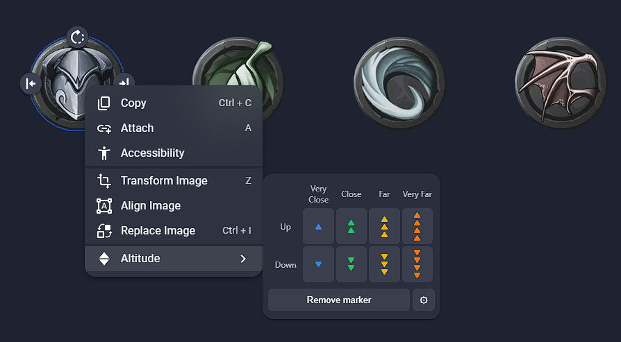
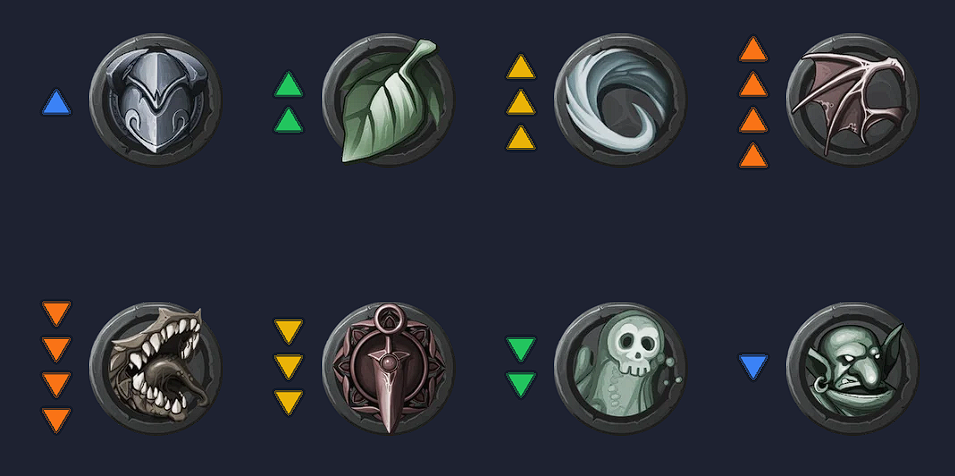
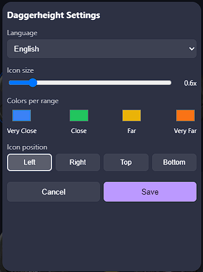

# Daggerheight

An [Owlbear Rodeo](https://www.owlbear.rodeo/) extension that marks **Daggerheart**
range bands directly on a token: Very Close, Close, Far, Very Far — each Up or
Down — shown as colored, stacked triangles next to the token.



## Install

Add this extension to your room using its manifest URL:

```
https://daggerheight.ijpedraza.com/manifest.json
```

## How to use

1. Select a token on the Character, Mount, or Prop layer and open its context menu.
2. Click **Altitude**.
3. Pick a range and a direction. Clicking the same marker again removes it.



Each token keeps its own marker, and markers move and scale together with their
token. Selecting multiple tokens (even across different layers) applies the
change to all of them at once.

## Settings

The gear icon opens a settings panel — shared by the whole room and set by the
GM — to customize icon size, colors per range, and where markers sit relative
to the token (left, right, top, or bottom). Changing a setting updates every
marker already placed in the scene.



The interface itself is available in English and Spanish, as a per-player
preference.

## Development

```
npm install
npm run dev
```

This starts a local dev server (`http://localhost:5173` by default). Owlbear
Rodeo allows loading development extensions from `localhost` without HTTPS.

To install the dev build in a room:

1. Open a room in Owlbear Rodeo.
2. Go to the extensions tab (plug icon) → **Add Custom Extension**.
3. Paste the manifest URL: `http://localhost:5173/manifest.json`.

With the dev server running, code changes hot-reload automatically.

## Production build

```
npm run build
```

Generates the `dist/` folder, ready to deploy to any static host. Point
Owlbear Rodeo at `https://<your-domain>/manifest.json` once deployed.

## Project structure

- `public/manifest.json` — extension metadata.
- `background.html` / `src/background.ts` — runs once when the extension loads;
  registers the context menu item.
- `index.html` / `src/main.ts` — the range picker UI shown when the context
  menu item is clicked.
- `settings.html` / `src/settings-main.ts` — the settings modal (size, colors,
  position, language).
- `src/altitude.ts` — the 8 range definitions and the triangle-stack geometry
  (shared between the on-map markers and the picker's preview icons).
- `src/markers.ts` — creates/reads/deletes the marker (a `PATH` item attached
  to the token) in the scene, and rebuilds every marker when settings change.
- `src/settings.ts` — reads/writes settings (room metadata) and language
  (player metadata).
- `src/theme.ts` — syncs Owlbear Rodeo's light/dark theme into CSS variables.
- `src/i18n.ts` — UI strings (English/Spanish).

## Support

Found a bug or have a feature request? Open an issue at
<https://github.com/nachoijp/daggerheight/issues>.
